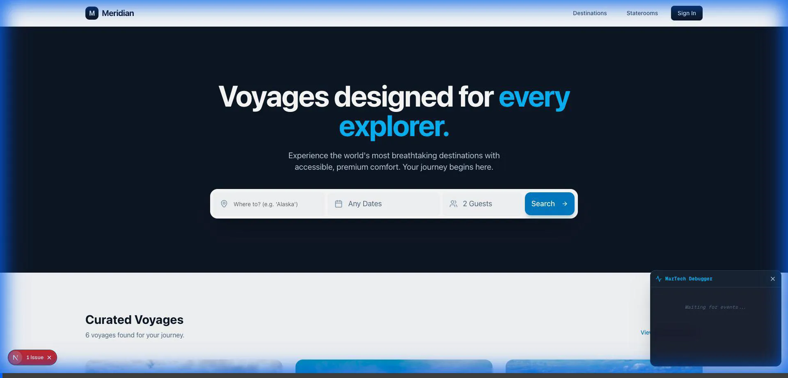

# Meridian Travel 🌍

[**🚀 Live Demo**](https://meridian-travel-69ym.vercel.app/)

A high-fidelity travel booking platform built with **Next.js 16**, **Tailwind CSS**, and **Leaflet**. This project demonstrates "Commercial Awareness" in frontend engineering by implementing dynamic pricing, geographically-aware discovery, and complex checkout logic.



## ✨ Key Features

### 1. 🗺️ Interactive Discovery
- **Dynamic Leaflet Map**: Users can explore voyages geographically.
- **Deep Linking**: Clicking a pin smooth-scrolls to the specific voyage card.
- **Real-Time Filtering**: The UI adapts based on user interactions.

### 2. 💰 Commercial Logic (The "Money" Part)
- **Shore Excursions Market**:
  - Automatically fetches activities based on itinerary (e.g., *Mendenhall Glacier* for Juneau stops).
  - Updates total cost in real-time.
- **Tiered Upselling**: Smart package selection (Standard vs. Plus vs. Premier) with dynamic benefit highlighting.

### 3. 🛳️ Stateroom Visualization
- **Deck Plan Logic**: Simulates cabin availability and pricing tiers (Interior vs. Suite).
- **Immersive UI**: Hover effects and grid layouts to showcase high-value inventory.

## 🛠️ Tech Stack

- **Framework**: [Next.js 16](https://nextjs.org/) (App Router)
- **Styling**: [Tailwind CSS](https://tailwindcss.com/) + [Shadcn UI](https://ui.shadcn.com/)
- **Maps**: [React Leaflet](https://react-leaflet.js.org/)
- **Icons**: [Lucide React](https://lucide.dev/)
- **State**: React Hooks (`useState`, `useEffect`) + LocalStorage (for Favorites)

## 🚀 Getting Started

First, run the development server:

```bash
npm run dev
# or
yarn dev
```

Open [http://localhost:3000](http://localhost:3000) with your browser to see the result.

## 🎥 As Seen on YouTube
This project was built live on **ishratsdevlog**. [Watch the video here](#) to see the step-by-step build process.

## 📝 License
MIT
